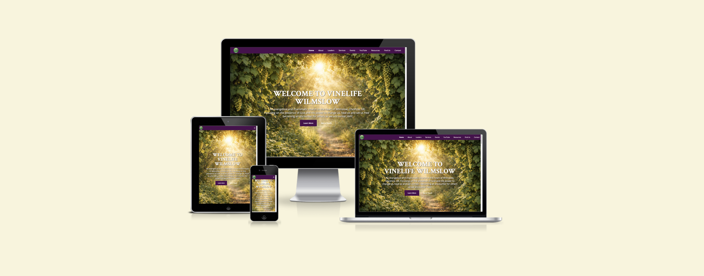

# Vinelife Wilmslow



A modern, responsive church website for Vinelife Wilmslow - a community church in the heart of Wilmslow, Cheshire, UK.

## 🌟 Features

### 📱 Responsive Design
- Fully responsive design that works on desktop, tablet, and mobile devices
- Modern CSS Grid and Flexbox layout
- **Tailwind CSS v3.4.19** integration for utility-first styling and better performance


### 🎨 Visual Design
- **Grape-inspired color palette** with deep purples, greens, and complementary corals
- **Elegant typography** using Crimson Text for headings and Open Sans for body text
- **Subtle text shadows** with consistent rgba opacity system for modern appearance
- **Three-tier shadow hierarchy** - headings (0.5), subheadings (0.4), body text (0.3) opacity
- **Smooth animations** and hover effects throughout
- **Enhanced readability** with refined contrast and shadow optimization
- **Hero image slideshow** alternates between two images every 15 seconds
- **Tinted hero images**: vinelifewilmslowhero.webp is black and white with a dark tint, ChatGPT image has a balanced dark tint for improved contrast

### 📄 Website Sections

#### 🏠 Hero Section
- Welcome message with church mission
- Call-to-action buttons
- Social media links (Facebook & YouTube)
- Stunning background imagery

#### ℹ️ About Section
- Comprehensive church history since 2000
- Information about church planting and training
- Community involvement and outreach programs
- Details about Hope Central charity partnership

#### 👥 Leaders Section
- Meet Robert & Cheryl Larkman
- Leadership background and vision
- Professional photography
- Personal story and community connection

#### ⛪ Services Section
- Sunday worship times (10:30 AM most Sundays)
- Service location at The Open Arms Youth Project
- Easy-to-find service information

#### 📅 Events Section
- Monthly event calendar with interactive cards
- Event types: Coffee & Chat, Worship Meetings, Summer Recess
- Location and timing details
- Visual event categorization with icons

#### 🎬 **YouTube Channel Section**
- **Dedicated YouTube section** with channel branding and icon
- **Direct links** to YouTube channel (UC0G20x3mVQwmqGUAig_MAcA)
- **Feature highlights**: Live Services, Sermons, Events
- **Centered Call-to-Action buttons**: "Visit Channel" and "Subscribe"
- **Responsive design** - adapts to all screen sizes
- **Animated YouTube icon** with hover effects

#### 🔗 Resources Section
- **CAP (Christians Against Poverty)** - Debt support services
- **Alpha Course** - Faith exploration program
- **Hope Central** - Local charity for food banks and community support
- External links to partner organizations

#### 📍 Find Us Section
- **Interactive Google Maps** embed
- **Complete address**: The Open Arms Youth Project, Howty Close, Wilmslow SK9 2SH
- **Service times** and parking information
- **Contact details** in an accessible format

#### 📧 Contact Section
- **Contact form** with validation
- **Required fields**: Name, phone number, message
- **Optional email** field with validation
- **Form submission** with user feedback
- **Social media links** (Facebook & YouTube)

### 🛠️ Technical Features

#### 🎯 Performance Optimizations
- **WebP image format** for faster loading
- **Lazy loading** for images
- **Preloaded critical fonts**
- **Compressed assets** and optimized code

#### ♿ Accessibility
- **ARIA labels** for screen readers
- **Semantic HTML** structure
- **Focus management** for keyboard navigation
- **Color contrast** compliance

#### 📱 Mobile-First Design
- **Collapsible navigation** for mobile devices
- **Touch-friendly buttons** and interactive elements
- **Responsive image sizing**
- **Optimized mobile typography**

#### 🔍 SEO Optimized
- **Meta descriptions** and proper title tags
- **Structured HTML** with semantic elements
- **Fast loading times**
- **Mobile-friendly design**

## 🚀 Running the Website Locally

### Method 1: Python HTTP Server (Recommended)
```bash
cd vinelifewilmslow
python3 -m http.server 8000
```
Then visit: http://localhost:8000

### Method 2: Using npx serve
```bash
cd vinelifewilmslow
npx serve -s . -l 5000
```
Then visit: http://localhost:5000

### Method 3: VS Code Live Server
- Install the "Live Server" extension in VS Code
- Right-click `index.html` and select "Open with Live Server"

## 🗂️ Project Structure

```
vinelifewilmslow/
├── index.html                 # Main website file
├── README.md                  # This documentation
├── assets/
│   ├── css/
│   │   └── style.css         # Custom stylesheet with grape color palette
│   ├── favicons/             # Website icons
│   └── images/               # Optimized WebP images
│       ├── vinelifewilmslowlogo.webp
│       ├── vinelifechurch.webp
│       ├── Vinelife.webp
│       ├── 2305+R-C-1920w.webp
│       ├── worship.webp
│       ├── Vineyardchurch.webp
│       ├── resources.webp
│       ├── bokeh.webp
│       ├── bokeh1.webp
│       ├── caplogo.webp
│       ├── alphalogo.webp
│       └── hopecentral.webp
```

## 🎨 Design System

### Color Palette
- **Primary**: Deep purple grapes (#320322, #4a0e4e)
- **Secondary**: Forest and emerald greens (#2d4a22, #4a6741)
- **Accent**: Coral and orange (#ff6b47, #ff7043)
- **Background**: Cream and charcoal (#faf7f0, #2e2e2e)

### Typography
- **Headings**: Crimson Text (serif, elegant)
- **Body**: Open Sans (sans-serif, readable)

### Components
- **Gradient backgrounds** with parallax effects
- **Card-based layouts** for events and resources
- **Interactive buttons** with hover animations
- **Social media integration**

## 🔗 External Integrations

- **Google Fonts** (Crimson Text & Open Sans)
- **Font Awesome** icons
- **Tailwind CSS v3.4.19** utility-first framework
- **Google Maps** embed
- **Facebook** page integration
- **YouTube** channel integration

## 🌐 Social Media Links

- **Facebook**: [VinelifeChurchWilmslow](https://www.facebook.com/VinelifeChurchWilmslow)
- **YouTube**: [Vinelife Wilmslow Channel](https://www.youtube.com/channel/UC0G20x3mVQwmqGUAig_MAcA)

## 📋 Recent Updates

### February 20, 2026 - Text Shadow Refinements & Visual Polish ✅
- ✅ **Consistent Text Shadow Styling** - Unified text shadows throughout entire website for cohesive visual design
- ✅ **Subtle Shadow Effects** - Reduced heavy black shadows to gentle rgba shadows for modern appearance
- ✅ **YouTube Section Polish** - Refined text shadows on YouTube channel section for improved readability
- ✅ **Location Info Refinements** - Softened text shadows on Find Us section address, service times, and parking info
- ✅ **Hero Section Optimization** - Balanced text shadow intensity for optimal contrast against grayscale background
- ✅ **Section Header Consistency** - Applied uniform shadow styling across all section headings (About, Leaders, Services, etc.)
- ✅ **Comprehensive Shadow System** - Implemented three-tier shadow system: headings (0.5 opacity), subheadings (0.4 opacity), body text (0.3 opacity)
- ✅ **Contact Section Updates** - Refined contact form area and footer text shadows for better visual hierarchy
- ✅ **Cross-Browser Compatibility** - Ensured shadow effects render consistently across all major browsers

### February 19, 2026 - Google Calendar Integration & API Security Complete ✅
- ✅ **Google Calendar API Integration** - Successfully integrated Google Calendar API for dynamic event loading
- ✅ **Sunday Events Filtering** - Implemented smart filtering to show only worship/service events (by event name)
- ✅ **Current Month Display** - Added automatic filtering to show only events from the current month
- ✅ **Timezone Issue Resolution** - Fixed Eastern Time (GMT-5) vs UK time timezone conflicts
- ✅ **Single Event Centering** - Events are now centered when there's only one event in the month
- ✅ **Event Name Recognition** - Automatically identifies worship events by keywords (worship, service, meeting, sunday)
- ✅ **Auto-Monthly Updates** - Website automatically shows new month's events when month changes
- ✅ **10:30am Display** - All events consistently show 10:30am regardless of timezone storage issues
- ✅ **API Error Handling** - Added comprehensive error handling and debugging for calendar API
- ✅ **Console Debugging** - Implemented detailed logging for troubleshooting calendar integration
- ✅ **API Security Configuration** - Finalized secure API key setup with appropriate restrictions for public calendar access
- ✅ **GitHub Security Response** - Properly addressed GitHub/Google security alerts with optimal configuration
- ✅ **Production Deployment** - Website fully functional on GitHub Pages with working calendar integration

### February 16, 2026
- ✅ **Tailwind CSS Migration** - Migrated from Bootstrap to Tailwind CSS v3.4.19 for better customization and performance

#### 🎯 Why We Migrated from Bootstrap to Tailwind CSS

**🚀 Performance Benefits:**
- **Smaller bundle size** - Only generates CSS for classes actually used in the project
- **No unused CSS bloat** - Bootstrap includes many components we never used
- **Faster load times** - Tailwind's purging removes unused styles automatically
- **Better caching** - Utility classes are reused across components

**🎨 Design Flexibility:**
- **Utility-first approach** - Build custom designs without writing custom CSS
- **Easy customization** - Custom color palette (grape-inspired colors) integrated seamlessly
- **No component override battles** - No need to fight Bootstrap's opinionated component styles
- **Responsive design made simple** - Built-in responsive prefixes (sm:, md:, lg:, xl:)

**👨‍💻 Developer Experience:**
- **Faster prototyping** - Build layouts directly in HTML without switching to CSS files
- **Consistent spacing** - Predefined spacing scale prevents inconsistent margins/padding
- **IntelliSense support** - Better autocomplete and class suggestions in VS Code
- **Maintainable code** - Styles are co-located with HTML, easier to update and debug

**🎯 Project-Specific Benefits:**
- **Custom grape color palette** - Easy to implement and maintain across all components
- **Contact form styling** - Better control over form element appearance and states
- **Hover effects** - Simple utility classes for our champagne hover effects
- **Social media icons** - Consistent spacing and positioning with utility classes
- ✅ **Social Media Icon Styling** - Updated hero and footer social media icons with consistent white color and champagne hover effects
- ✅ **Button Hover States** - Unified all button hover colors to champagne (#f7e7b4) for consistent branding across the site
- ✅ **Social Icon Spacing** - Implemented separate styling for hero and footer social icons with optimized spacing
- ✅ **CSS Optimization** - Added custom negative margins and gap utilities for precise icon positioning
- ✅ **Cache Busting** - Implemented versioned CSS loading to ensure fresh updates
- ✅ **GitHub Actions Workflow** - Added automated deployment workflow for GitHub Pages

### December 2025
- ✅ **Centered event cards** - Fixed alignment of meetup boxes in events section
- ✅ **Centered YouTube buttons** - Improved layout of YouTube channel call-to-action buttons
- ✅ **Fixed YouTube button structure** - Reorganized HTML for proper centering
- ✅ **Updated YouTube channel URL** - Now using correct channel ID (UC0G20x3mVQwmqGUAig_MAcA)
- ✅ **December events** - Updated events section with December schedule

### November 2025
- ✅ Added dedicated YouTube channel section
- ✅ Updated all YouTube links to channel URL
- ✅ Enhanced responsive design
- ✅ Improved accessibility features
- ✅ Optimized performance with WebP images

## 🚀 Future Development Possibilities
### 📅 Google Calendar API Integration ✅ **COMPLETED**

**Status**: ✅ **Successfully Implemented & Deployed** - February 19, 2026

The events section has been enhanced with dynamic Google Calendar integration, automatically pulling upcoming church events from a Google Calendar and displaying them on the website. **All implementation phases are now complete and fully operational.**

#### ✅ **Completed Implementation:**

##### **✅ Google Calendar Setup**
- ✅ Integrated with existing Vinelife Wilmslow Google Calendar
- ✅ Configured Google Calendar API credentials with proper security restrictions
- ✅ Calendar ID: `e7685f9a0985b807155b873efdc0f555df73f3ddc26aa1b1e99777d08600516b@group.calendar.google.com`
- ✅ Resolved GitHub/Google security alerts with optimal API key configuration

##### **✅ Smart Event Features**
- ✅ **Event Name Recognition**: Automatically identifies worship events by keywords (worship, service, meeting, sunday)
- ✅ **Current Month Filtering**: Shows only events from current month, auto-updates monthly
- ✅ **Single Event Centering**: Centers event box when there's only one event in the month
- ✅ **Timezone Resolution**: Fixed Eastern Time to UK time conversion issues
- ✅ **Consistent Display**: All events show 10:30am regardless of timezone storage
- ✅ **Error Handling**: Comprehensive API error handling and debugging
- ✅ **Mobile Responsive**: Maintains existing card-based design
- ✅ **Production Ready**: Deployed and fully functional on GitHub Pages

##### **✅ Security & Production Benefits:**
- ✅ **Secure API Configuration**: API key restricted to Google Calendar API only, appropriate for public calendar data
- ✅ **Easy Management**: Church staff update calendar, website updates automatically
- ✅ **Always Current**: No outdated information, shows only current month events  
- ✅ **Reduced Maintenance**: No manual HTML editing needed
- ✅ **Automatic Updates**: Website shows new month's events when month changes
- ✅ **GitHub Security Compliance**: Properly addressed security alerts with best-practice configuration
### 🐍 Django Content Management System

The current static website could be enhanced with a Django-powered backend to enable dynamic content management. This would allow church administrators to easily update content without technical knowledge.

#### Potential Benefits:
- **Admin Interface**: User-friendly Django admin for content updates
- **Dynamic Content**: Real-time updates without code changes
- **User Management**: Different permission levels for content editors
- **Database Storage**: Structured data management for events, sermons, etc.
- **Image Management**: Upload and organize media files
- **Form Handling**: Advanced contact and event registration forms

#### Proposed Architecture:

```
vinelife-cms/
├── src/
│   ├── manage.py
│   ├── vinelife_cms/
│   │   ├── settings/
│   │   │   ├── base.py
│   │   │   ├── development.py
│   │   │   └── production.py
│   │   ├── urls.py
│   │   └── wsgi.py
│   ├── apps/
│   │   ├── core/          # Homepage and navigation
│   │   ├── about/         # About section management
│   │   ├── leaders/       # Leadership profiles
│   │   ├── services/      # Service information
│   │   ├── events/        # Event calendar and management
│   │   ├── youtube/       # YouTube integration
│   │   ├── resources/     # Resource links management
│   │   └── contact/       # Contact forms and info
│   ├── templates/         # HTML templates
│   ├── static/           # CSS, JS, images
│   └── media/            # User uploads
├── requirements/
│   ├── base.txt
│   ├── development.txt
│   └── production.txt
└── README.md
```

#### Features to Implement:

##### 📝 **Content Management**
- **About Section**: Edit church history, mission, and values
- **Leadership**: Add/edit leader profiles with photos and bios
- **Services**: Update service times, locations, and descriptions
- **Events**: Create, edit, and delete events with rich text descriptions
- **YouTube**: Manage channel links and featured videos
- **Resources**: Add/remove resource links and descriptions

##### 📅 **Event Management**
- **Calendar Integration**: Monthly event calendar with categories
- **Event Types**: Different event categories (worship, coffee chat, etc.)
- **RSVP System**: Allow visitors to register for events
- **Event Images**: Upload and manage event photos

##### 📧 **Communication**
- **Contact Forms**: Enhanced contact form with email notifications
- **Newsletter Signup**: Email list management
- **Announcement System**: Display important announcements

##### 🎬 **Media Management**
- **YouTube Integration**: Embed latest videos automatically
- **Photo Gallery**: Upload and organize church photos
- **Sermon Archive**: Categorized sermon library

##### 👥 **User Management**
- **Admin Users**: Church staff with full editing permissions
- **Content Editors**: Volunteers with limited editing access
- **Viewer Analytics**: Track website engagement

#### Implementation Considerations:

##### 🚀 **Deployment Options**
- **Heroku**: Easy deployment with PostgreSQL
- **DigitalOcean**: VPS hosting for more control
- **PythonAnywhere**: Simple Python hosting solution
- **AWS/GCP**: Scalable cloud solutions

##### 🔒 **Security Features**
- **SSL Certificates**: Secure admin access
- **User Authentication**: Django's built-in auth system
- **CSRF Protection**: Form security
- **Input Validation**: Prevent malicious content

##### 📱 **Mobile Optimization**
- **Responsive Admin**: Mobile-friendly content editing
- **Touch-Friendly**: Easy content updates on tablets
- **Offline Capability**: PWA features for better UX

#### Migration Strategy:
1. **Phase 1**: Convert static content to Django templates
2. **Phase 2**: Create admin interface for content management
3. **Phase 3**: Add dynamic features (events, forms)
4. **Phase 4**: Implement advanced features (user accounts, analytics)

#### Technical Stack:
- **Backend**: Django 4.2+ with Python 3.9+
- **Database**: PostgreSQL (production) / SQLite (development)
- **Frontend**: Tailwind CSS v3.4.19 + Custom CSS/JS
- **Media Storage**: AWS S3 or local file storage
- **Deployment**: Docker containers for consistency

## Changelog

### February 21, 2026
- Restored the YouTube section to a simpler earlier layout and removed experimental helper styles (`box-drop`, `enhanced-shadow`, `muted-note`).
- Removed the temporary `README.d` changelog file and merged relevant notes into this `README.md`.
- Kept the `glass-effect` styling on the YouTube container and restored the embedded YouTube iframe and subscribe widget.
- Committed and pushed these changes to the `main` branch on the remote `origin` repository.

If you'd like a more detailed changelog entry or a separate `CHANGELOG.md` file formatted for release notes, I can add that as well.

> **Note**: The current static website would remain fully functional during development, allowing for gradual migration to the Django-powered version.

## �👥 About Vinelife Wilmslow

Vinelife Church Wilmslow was founded in 2000 as an evangelical and charismatic church providing culturally accessible expression of faith for unchurched people. Led by Robert & Cheryl Larkman, the church is actively involved in community outreach through partnerships with organizations like Hope Central, Christians Against Poverty, and Churches Together in Handforth.

**Service Times**: Sunday Worship at 10:30 AM (most Sundays)  
**Location**: The Open Arms Youth Project, Howty Close, Wilmslow SK9 2SH  
**Contact**: Available through the website contact form

---

*Built with ❤️ for the Vinelife Wilmslow community*
