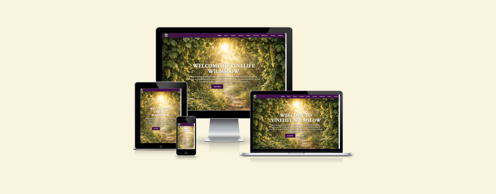
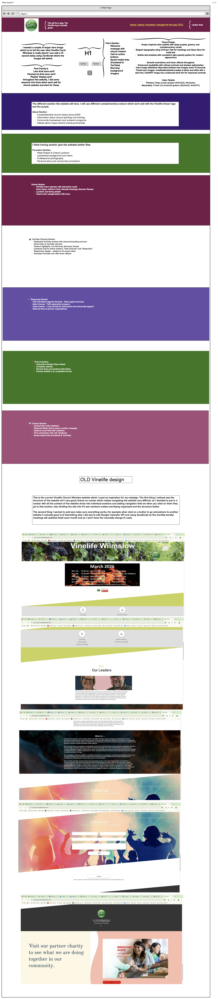

# Vinelife Wilmslow



A modern, responsive church website for Vinelife Wilmslow - a community church in the heart of Wilmslow, Cheshire, UK, **now with Wagtail CMS for easy content management**.

## 🌟 Features

### 📖 Content Management System (Wagtail CMS)
- **Wagtail 5.2.0** - A user-friendly Django-based headless CMS
- **No coding required** - Manage all website content through an intuitive admin interface
- **Rich text editing** - Format content easily with built-in editor
- **Image management** - Upload and manage church photos seamlessly
- **Flexible pages** - Fully customizable HomePage with 80+ fields for all sections
- **Environment-based configuration** - Secure API keys and settings

### 📱 Responsive Design
- Fully responsive design that works on desktop, tablet, and mobile devices
- Modern CSS Grid and Flexbox layout
- **Tailwind CSS v3.4.19** integration for utility-first styling and better performance


### 🎨 Visual Design
- **Grape-inspired color palette** with deep purples, greens, and complementary corals
- **Consistent typography** using Sohne Schmal/Inter with varied font weights for hierarchy
- **Subtle text shadows** with consistent rgba opacity system for modern appearance
- **Three-tier shadow hierarchy** - headings (0.5), subheadings (0.4), body text (0.3) opacity
- **Smooth animations** and hover effects throughout
- **Enhanced readability** with refined contrast and shadow optimization
- **Hero image slideshow** alternates between two images every 15 seconds
- **Tinted hero images**: vinelifewilmslowhero.webp is black and white with a dark tint, ChatGPT image has a balanced dark tint for improved contrast

#### 🎯 Design Inspiration
- This site takes visual inspiration from the **Waitrose** website, especially in the use of confident, clean color direction and palette-led styling.
- It also draws inspiration from the **Society for the Protection of Unborn Children (SPUC)** website, particularly its use of a consistent font family with varied weights (regular, semibold, bold) to create hierarchy and emphasis.
- A key influence was how strong, vibrant color is used to highlight important calls to action.
- I also liked the amount of content available across the site experience, and that informed the decision to include a larger **Media Library** with additional Vinelife YouTube videos so visitors have more to choose from.

**SPUC reference:** [spuc.org.uk](https://spuc.org.uk)

#### 📊 Technologies

**Backend**
- **Django 4.2.13** - Python web framework
- **Wagtail 5.2.0** - CMS built on Django
- **SQLite** - Lightweight database
- **python-dotenv** - Environment variable management

**Frontend**
- **Tailwind CSS 3.4.19** - Utility-first CSS framework
- **HTML5** - Semantic markup
- **Vanilla JavaScript** - No frameworks for simple interactions

**DevOps & Security**
- **Python 3.13** - Runtime
- **pip** - Package manager
- **Git** - Version control
- **.env file** - Secure secrets management (API keys, SECRET_KEY)
- **Environment variables** - All sensitive data externalized

**External Integrations**
- **Google Calendar API** - Events management
- **Bible API** - Daily verse selection
- **Formspree** - Contact form submissions
- **YouTube Embed** - Video integration

#### 🧩 Wireframe
- **Website wireframe (PDF):** [Vinelife Church Wilmslow Wireframe v1](docs/wireframes/vinelifechurchwilmslow-wireframe-v1.pdf)
- **Website wireframe (Image):**




---

## 🛠 2026-04-16 Update - Database Recovery & YouTube Fix

### ✨ Latest Changes
- **Database Recovery**: Recreated SQLite database from migrations after deletion
- **YouTube Embed Fix**: Fixed video display - changed from watch URLs to embed format
- **Environment Configuration**: Secured all API keys and secrets in `.env` file
- **Admin Interface**: Live and functional at http://127.0.0.1:8000/admin/
- **All Sections Working**: Homepage displaying all sections with full functionality

### 🔧 Technical Improvements
- **Updated requirements.txt** with correct package versions (Django 4.2.13, Wagtail 5.2.0)
- **Installed python-dotenv** for environment variable management
- **Security Hardened**: API keys no longer hardcoded in templates/settings
- **Migrations Applied**: All database tables created and functional
- **Custom HomePage Script**: Created workaround for treebeard path issues

### 📋 Working Features
- ✅ HomePage with all sections properly rendering
- ✅ YouTube channel with video embedding (embed URL format)
- ✅ Google Calendar integration for events
- ✅ Bible API for daily verses
- ✅ Contact form with Formspree
- ✅ Media library with video links
- ✅ Responsive design on all devices
- ✅ Admin editing interface

### 🚀 Quick Start
```bash
# 1. Install dependencies
pip install -r requirements.txt

# 2. Run migrations (database setup)
python manage.py migrate

# 3. Create superuser (if not exists)
python manage.py createsuperuser

# 4. Start server
python manage.py runserver

# 5. Visit admin panel
# http://127.0.0.1:8000/admin/
# Username: danielcarson
# Password: po@Ched8romans26
```

### ⚙️ Environment Configuration

**Setup .env file:**
Copy `.env.example` to `.env` and configure:
```bash
cp .env.example .env
```

**Required variables in .env:**
```env
SECRET_KEY=your-secret-key-here
DEBUG=True  # Set to False in production
ALLOWED_HOSTS=localhost,127.0.0.1

# Google Calendar API
GOOGLE_CALENDAR_ID=your-calendar-id
GOOGLE_CALENDAR_API_KEY=your-api-key

# Formspree Contact Form
FORMSPREE_ENDPOINT=https://formspree.io/f/your-form-id

# Site Configuration
WAGTAIL_SITE_NAME=Vinelife Church Wilmslow
WAGTAILADMIN_BASE_URL=http://127.0.0.1:8000
```

**Security Notes:**
- ✅ `.env` file is in `.gitignore` - secrets won't be committed
- ✅ `SECRET_KEY` loaded from env variables
- ✅ All API keys externalized in `.env`
- ✅ DEBUG mode controllable via environment

### 📺 YouTube Configuration

To add a YouTube video:
1. Go to http://127.0.0.1:8000/admin/pages/3/edit/pages/
2. Find "YouTube Channel" section
3. Enter embed URL: `https://www.youtube.com/embed/VIDEO_ID`
   - Example: `https://www.youtube.com/embed/7ZSEQlR2YZs`
4. Save and publish

**Note**: Use `embed/` format, not `watch?v=` format

---

## 🛠 2026-04-08 Update - Wagtail CMS Implementation

### ✨ Major Changes
- **Migrated to Wagtail 5.2.0** for professional content management
- **Replaced Django admin** with user-friendly Wagtail interface
- **Created comprehensive page models** for all website sections
- **Added image management** with automatic optimization
- **Implemented orderable content** (drag-and-drop sorting)

### 🔧 Technical Updates
- **Installed dependencies**: wagtail-5.2.0, pillow, django-environ, python-dotenv, etc.
- **Updated Django settings** with complete Wagtail configuration
- **Configured URL routing** for `/admin/` (Wagtail) and cascading pages
- **Database migrations** completed - all Wagtail tables created
- **Static files** configured for Wagtail admin interface

### 📋 Content Models
The `HomePage` model includes fields for:
- Hero section (images, titles, CTAs)
- Mission statement and history
- Founders information
- YouTube embed URL
- Thought for the day
- Events and worship meetings
- Groups (Men's and Women's)
- Media library references
- Resources with external links
- Contact information and social media

### 🚀 Admin Access
1. Start server: `python manage.py runserver`
2. Visit: http://127.0.0.1:8000/admin/
3. Log in with your superuser credentials
4. Create and edit pages in the Wagtail interface
5. Publish to make content live

---

## 🛠 2026-04-01 Update

- **Special Events grid now always centers event boxes**: The special events section uses a single-column grid, is centered, and has a max width for a visually balanced look. This ensures that even a single event (like EASTERFEST) is always centered on desktop and laptop.
- **Consistent event box sizing**: All `.meetup-box` elements (for both Sunday Worship Meetings and Special Events) now use the same grid and sizing rules for a unified appearance across all devices.
- **Code cleanup**: Removed unnecessary flex/grid classes and duplicate inline styles from the special events container. Improved maintainability and visual consistency.
- **No changes to core functionality or branding.**

---

### 📄 Website Sections

#### 🏠 Hero Section
- Welcome message with church mission
- Call-to-action buttons
- Social media links (Facebook & YouTube)
- Stunning background imagery

#### ℹ️ About Section
- Comprehensive church history since 2000
- Information about church planting and training
- Community involvement and outreach programs
- Details about Hope Central charity partnership

#### 👥 Leaders Section
- Meet Robert & Cheryl Larkman
- Leadership background and vision
- Professional photography
- Personal story and community connection

#### ⛪ Services Section
- Sunday worship times (10:30 AM most Sundays)
- Service location at The Open Arms Youth Project
- Easy-to-find service information

#### 📅 Events Section
- Monthly event calendar with interactive cards
- Event types: Coffee & Chat, Worship Meetings, Summer Recess
- Location and timing details
- Visual event categorization with icons

#### 🎬 **YouTube Channel Section**
- **Dedicated YouTube section** with video embedding
- **Direct video embed** with responsive iframe (embed URL format)
- **Editable via admin** - Change video URL in Wagtail admin panel
- **Responsive design** - Adapts to all screen sizes
- **Media Library**: Links to multiple Vinelife videos and playlists
- **Full YouTube integration** working with proper embed URLs

#### 🔗 Resources Section
- **CAP (Christians Against Poverty)** - Debt support services
- **Alpha Course** - Faith exploration program
- **Hope Central** - Local charity for food banks and community support
- External links to partner organizations

#### 📍 Find Us Section
- **Interactive Google Maps** embed
- **Complete address**: The Open Arms Youth Project, Howty Close, Wilmslow SK9 2SH
- **Service times** and parking information
- **Contact details** in an accessible format

#### 📧 Contact Section
- **Contact form** with validation
- **Required fields**: Name, phone number, message
- **Optional email** field with validation
- **Form submission** with user feedback
- **Social media links** (Facebook & YouTube)

### 🛠️ Technical Features

#### 📈 Google Analytics Integration
- **Google Analytics 4 (gtag.js)** is integrated for website traffic and engagement tracking. The tracking code is included in the <head> of index.html using your property ID (`G-WM69C53YSW`).
- To verify or customize, see the following snippet in index.html:

```html
<!-- Google tag (gtag.js) -->
<script async src="https://www.googletagmanager.com/gtag/js?id=G-WM69C53YSW"></script>
<script>
	window.dataLayer = window.dataLayer || [];
	function gtag(){dataLayer.push(arguments);}
	gtag('js', new Date());
	gtag('config', 'G-WM69C53YSW');
</script>
```

#### 🎯 Performance Optimizations
- **WebP image format** for faster loading
- **Lazy loading** for images
- **Preloaded critical fonts**
- **Compressed assets** and optimized code

#### ♿ Accessibility
- **ARIA labels** for screen readers
- **Semantic HTML** structure
- **Focus management** for keyboard navigation
- **Color contrast** compliance

#### 📱 Mobile-First Design
- **Collapsible navigation** for mobile devices
- **Touch-friendly buttons** and interactive elements
- **Responsive image sizing**
- **Optimized mobile typography**

#### 🔍 SEO Optimized
- **Meta descriptions** and proper title tags
- **Structured HTML** with semantic elements
- **Fast loading times**
- **Mobile-friendly design**

## 🎛️ Wagtail CMS - Content Management

### 🔑 Admin Access
- **Admin URL**: http://127.0.0.1:8000/admin/
- **Username**: `danielcarson`
- **Password**: `po@Ched8romans26`

### 📝 HomePage Features
The HomePage model includes comprehensive fields for:
- **Hero Section**: Title, images, call-to-action buttons, social links
- **Mission & History**: Church mission statement and full history
- **Founders**: Information about church founders (Robert & Cheryl Larkman)
- **YouTube Section**: Embed URL for video (editable from admin)
- **Thought for Day**: Daily Bible verses from Bible API
- **Events**: Google Calendar integration for worship and special events
- **Groups**: Men's and Women's groups with contact information
- **Media Library**: Curated videos and playlists
- **Resources**: Links to Alpha, CAP, Hope Central
- **Contact Info**: Phone, email, address, social media

### 🚀 Running the CMS Locally

#### Prerequisites
- Python 3.13+ (use pyenv to manage versions)
- Virtual environment (venv) activated
- Dependencies installed: `pip install -r requirements.txt`
- `.env` file configured with API keys

#### Step 1: Database Setup
```bash
# Apply all migrations
python manage.py migrate

# Create a new superuser (if needed)
python manage.py createsuperuser
```

#### Step 2: Start the Development Server
```bash
python manage.py runserver
```

Server runs at: **http://127.0.0.1:8000/**

#### Step 3: Access Wagtail Admin
1. Visit http://127.0.0.1:8000/admin/
2. Log in with your superuser credentials
3. Navigate to Pages > Vinelife Wilmslow > HomePage to edit
4. Make changes and click "Save" then "Publish"

### 🐛 Troubleshooting

**Port 8000 already in use:**
```bash
# Kill existing process on port 8000
lsof -ti:8000 | xargs kill -9

# Then start server again
python manage.py runserver
```

**Missing dependencies:**
```bash
# Reinstall all requirements
pip install -r requirements.txt
```

**YouTube video not displaying:**
- Ensure URL uses `embed/` format: `https://www.youtube.com/embed/VIDEO_ID`
- Not: `https://www.youtube.com/watch?v=VIDEO_ID`

**API keys not working:**
- Verify `.env` file exists in project root
- Check GOOGLE_CALENDAR_API_KEY and FORMSPREE_ENDPOINT are set
- Restart server after .env changes: `python manage.py runserver`

**Database errors:**
```bash
# Reset database (WARNING: deletes all data!)
rm db.sqlite3
python manage.py migrate
python manage.py createsuperuser
```

**Static files missing:**
```bash
python manage.py collectstatic
```

---

### 🔄 Content Workflow

1. **Login to Wagtail Admin** at http://127.0.0.1:8000/admin/
2. **Navigate to Pages** → Find "Vinelife Wilmslow" home page
3. **Edit HomePage fields** - All content sections are in one editable page
4. **Click Save** to save draft changes
5. **Click Publish** to make changes live on website
6. **View on website** - Changes appear immediately at http://127.0.0.1:8000/
4. **Upload images** using the image uploader
5. **Add sub-items** (e.g., team members, service times) using inline panels
6. **Publish or save as draft** using the "Publish" or "Save draft" buttons
7. **View live page** by clicking the eye icon

### 🖼️ Managing Images

- Maximum recommended size: 2MB for optimal loading
- Supported formats: JPG, PNG, WebP (recommended for best performance)
- Images are automatically optimized by Wagtail
- All church images stored in `/media/images/` directory

### 💾 Database & Backups

- Database file: `db.sqlite3` (SQLite)
- Media files stored in: `media/` directory
- **Important**: Back up `db.sqlite3` and `media/` folder regularly

### ⚙️ Database Maintenance

#### Reset Database (Emergency Only)
```bash
rm db.sqlite3
python manage.py migrate
python manage.py shell
```

Then in Python shell:
```python
from django.contrib.auth.models import User
User.objects.create_superuser('admin', 'admin@vinelife.com', 'ChangeMe123!')
exit()
```

---

## 🚀 Running the Website Locally

### Method 1: Python HTTP Server (Recommended)
```bash
cd vinelifewilmslow
python3 -m http.server 8000
```
Then visit: http://localhost:8000

### Method 2: Using npx serve
```bash
cd vinelifewilmslow
npx serve -s . -l 5000
```
Then visit: http://localhost:5000

### Method 3: VS Code Live Server
- Install the "Live Server" extension in VS Code
- Right-click `index.html` and select "Open with Live Server"

## 🗂️ Project Structure

```
vinelifewilmslow/
├── manage.py                  # Django management script
├── db.sqlite3                 # Database (SQLite)
├── index.html                 # Static frontend (legacy)
├── README.md                  # This documentation
├── package.json               # Node dependencies
├── tailwind.config.js         # Tailwind CSS configuration
├── postcss.config.js          # PostCSS configuration
├── vinelife_cms/              # Django project folder
│   ├── settings.py            # Django settings (Wagtail config)
│   ├── urls.py                # URL routing
│   ├── asgi.py                # ASGI app for Daphne
│   └── wsgi.py                # WSGI app for production
├── core/                      # Django app for Wagtail pages
│   ├── models.py              # Wagtail page models
│   ├── admin.py               # Admin configuration
│   ├── migrations/            # Database migrations
│   └── templates/
│       └── core/              # Page templates
├── media/                     # Uploaded images and documents
│   └── images/                # Church photos and assets
├── docs/
│   └── wireframes/
│       └── vinelifechurchwilmslow-wireframe-v1.pdf
├── assets/
│   ├── css/
│   │   ├── input.css          # Tailwind input
│   │   └── style.css          # Compiled styles
│   ├── favicons/              # Website icons
│   └── images/                # Optimized WebP images
│       ├── vinelifewilmslowlogo.webp
│       ├── vinelifechurch.webp
│       └── ... (other images)
└── .gitignore                 # Git ignore rules
```

## 🎨 Design System

### Color Palette
- **Primary**: Deep purple grapes (#320322, #4a0e4e)
- **Secondary**: Forest and emerald greens (#2d4a22, #4a6741)
- **Accent**: Coral and orange (#ff6b47, #ff7043)
- **Background**: Cream and charcoal (#faf7f0, #2e2e2e)

#### Waitrose-Inspired Palette Gradient


```css
/* Gradient in Hex */
linear-gradient(to right, #C5D700 12.437810945273633%, 21.599836144641998%, #FFFFFF 35.90381426202322%, 42.95190713101161%, #F3F3F3 50%, 61.52570480928689%, #114734 70.8955223880597%, 82.91873963515755%, #54565A 91.37645107794361%);

/* Gradient in RGBA */
linear-gradient(to right, rgba(197, 215, 0, 1) 12.437810945273633%, 21.599836144641998%, rgba(255, 255, 255, 1) 35.90381426202322%, 42.95190713101161%, rgba(243, 243, 243, 1) 50%, 61.52570480928689%, rgba(17, 71, 52, 1) 70.8955223880597%, 82.91873963515755%, rgba(84, 86, 90, 1) 91.37645107794361%);
```

### Typography
- **Primary font family**: Sohne Schmal with Inter fallback
- **Usage approach**: one core sans-serif family with varied weights (regular, semibold, bold)

### Components
- **Gradient backgrounds** with parallax effects
- **Card-based layouts** for events and resources
- **Interactive buttons** with hover animations
- **Social media integration**

## 🔗 External Integrations

- **Google Fonts** (Crimson Text & Open Sans)
- **Font Awesome** icons
- **Tailwind CSS v3.4.19** utility-first framework
- **Google Maps** embed
- **Facebook** page integration
- **YouTube** channel integration

## 🌐 Social Media Links

- **Facebook**: [VinelifeChurchWilmslow](https://www.facebook.com/VinelifeChurchWilmslow)
- **YouTube**: [Vinelife Wilmslow Channel](https://www.youtube.com/channel/UC0G20x3mVQwmqGUAig_MAcA)

## 📋 Recent Updates
### March 28, 2026
- Added advanced Google Analytics tracking:
	- **Scroll-based section view tracking** using Intersection Observer API. Now tracks when users view each major section of the site.
	- **Click-based navigation tracking** for all navigation bar links. Tracks which sections users navigate to via clicks.
- Both tracking methods send custom events to Google Analytics 4 (gtag.js) for improved insight into user engagement.
- See `index.html` for implementation details.


### March 7, 2026
- Updated site wording from `About` to `Mission` in key user-facing labels.
- Reordered the Resources cards to: `Alpha`, `CAP`, `Hope Central`.
- Fixed Resources card alignment by standardizing logo sizing and spacing.
- Updated the global page background to `#F3F3F3` for a softer site backdrop.

### March 1, 2026
- Fixed navigation bug: restored default anchor navigation by removing faulty JavaScript that prevented navbar links from working.
- Improved styles for resource boxes and navigation bar.
- Updated scripts for hero image slideshow and event calendar integration.
- Committed and pushed all changes to GitHub (`new-design` branch).

### February 21, 2026
- Restored the YouTube section to a simpler earlier layout and removed experimental helper styles (`box-drop`, `enhanced-shadow`, `muted-note`).
- Removed the temporary `README.d` changelog file and merged relevant notes into this `README.md`.
- Kept the `glass-effect` styling on the YouTube container and restored the embedded YouTube iframe and subscribe widget.
- Committed and pushed these changes to the `main` branch on the remote `origin` repository.

If you'd like a more detailed changelog entry or a separate `CHANGELOG.md` file formatted for release notes, I can add that as well.

### February 20, 2026 - Text Shadow Refinements & Visual Polish ✅
- ✅ **Consistent Text Shadow Styling** - Unified text shadows throughout entire website for cohesive visual design
- ✅ **Subtle Shadow Effects** - Reduced heavy black shadows to gentle rgba shadows for modern appearance
- ✅ **YouTube Section Polish** - Refined text shadows on YouTube channel section for improved readability
- ✅ **Location Info Refinements** - Softened text shadows on Find Us section address, service times, and parking info
- ✅ **Hero Section Optimization** - Balanced text shadow intensity for optimal contrast against grayscale background
- ✅ **Section Header Consistency** - Applied uniform shadow styling across all section headings (About, Leaders, Services, etc.)
- ✅ **Comprehensive Shadow System** - Implemented three-tier shadow system: headings (0.5 opacity), subheadings (0.4 opacity), body text (0.3 opacity)
- ✅ **Contact Section Updates** - Refined contact form area and footer text shadows for better visual hierarchy
- ✅ **Cross-Browser Compatibility** - Ensured shadow effects render consistently across all major browsers

### February 19, 2026 - Google Calendar Integration & API Security Complete ✅
- ✅ **Google Calendar API Integration** - Successfully integrated Google Calendar API for dynamic event loading
- ✅ **Sunday Events Filtering** - Implemented smart filtering to show only worship/service events (by event name)
- ✅ **Current Month Display** - Added automatic filtering to show only events from the current month
- ✅ **Timezone Issue Resolution** - Fixed Eastern Time (GMT-5) vs UK time timezone conflicts
- ✅ **Single Event Centering** - Events are now centered when there's only one event in the month
- ✅ **Event Name Recognition** - Automatically identifies worship events by keywords (worship, service, meeting, sunday)
- ✅ **Auto-Monthly Updates** - Website automatically shows new month's events when month changes
- ✅ **10:30am Display** - All events consistently show 10:30am regardless of timezone storage issues
- ✅ **API Error Handling** - Added comprehensive error handling and debugging for calendar API
- ✅ **Console Debugging** - Implemented detailed logging for troubleshooting calendar integration
- ✅ **API Security Configuration** - Finalized secure API key setup with appropriate restrictions for public calendar access
- ✅ **GitHub Security Response** - Properly addressed GitHub/Google security alerts with optimal configuration
- ✅ **Production Deployment** - Website fully functional on GitHub Pages with working calendar integration

### February 16, 2026
- ✅ **Tailwind CSS Migration** - Migrated from Bootstrap to Tailwind CSS v3.4.19 for better customization and performance

#### 🎯 Why We Migrated from Bootstrap to Tailwind CSS

**🚀 Performance Benefits:**
- **Smaller bundle size** - Only generates CSS for classes actually used in the project
- **No unused CSS bloat** - Bootstrap includes many components we never used
- **Faster load times** - Tailwind's purging removes unused styles automatically
- **Better caching** - Utility classes are reused across components

**🎨 Design Flexibility:**
- **Utility-first approach** - Build custom designs without writing custom CSS
- **Easy customization** - Custom color palette (grape-inspired colors) integrated seamlessly
- **No component override battles** - No need to fight Bootstrap's opinionated component styles
- **Responsive design made simple** - Built-in responsive prefixes (sm:, md:, lg:, xl:)

**👨‍💻 Developer Experience:**
- **Faster prototyping** - Build layouts directly in HTML without switching to CSS files
- **Consistent spacing** - Predefined spacing scale prevents inconsistent margins/padding
- **IntelliSense support** - Better autocomplete and class suggestions in VS Code
- **Maintainable code** - Styles are co-located with HTML, easier to update and debug

**🎯 Project-Specific Benefits:**
- **Custom grape color palette** - Easy to implement and maintain across all components
- **Contact form styling** - Better control over form element appearance and states
- **Hover effects** - Simple utility classes for our champagne hover effects
- **Social media icons** - Consistent spacing and positioning with utility classes
- ✅ **Social Media Icon Styling** - Updated hero and footer social media icons with consistent white color and champagne hover effects
- ✅ **Button Hover States** - Unified all button hover colors to champagne (#f7e7b4) for consistent branding across the site
- ✅ **Social Icon Spacing** - Implemented separate styling for hero and footer social icons with optimized spacing
- ✅ **CSS Optimization** - Added custom negative margins and gap utilities for precise icon positioning
- ✅ **Cache Busting** - Implemented versioned CSS loading to ensure fresh updates
- ✅ **GitHub Actions Workflow** - Added automated deployment workflow for GitHub Pages

### December 2025
- ✅ **Centered event cards** - Fixed alignment of meetup boxes in events section
- ✅ **Centered YouTube buttons** - Improved layout of YouTube channel call-to-action buttons
- ✅ **Fixed YouTube button structure** - Reorganized HTML for proper centering
- ✅ **Updated YouTube channel URL** - Now using correct channel ID (UC0G20x3mVQwmqGUAig_MAcA)
- ✅ **December events** - Updated events section with December schedule

### November 2025
- ✅ Added dedicated YouTube channel section
- ✅ Updated all YouTube links to channel URL
- ✅ Enhanced responsive design
- ✅ Improved accessibility features
- ✅ Optimized performance with WebP images

## 🚀 Future Development Possibilities
### 📅 Google Calendar API Integration ✅ **COMPLETED**

**Status**: ✅ **Successfully Implemented & Deployed** - February 19, 2026

The events section has been enhanced with dynamic Google Calendar integration, automatically pulling upcoming church events from a Google Calendar and displaying them on the website. **All implementation phases are now complete and fully operational.**

#### ✅ **Completed Implementation:**

##### **✅ Google Calendar Setup**
- ✅ Integrated with existing Vinelife Wilmslow Google Calendar
- ✅ Configured Google Calendar API credentials with proper security restrictions
- ✅ Calendar ID: `e7685f9a0985b807155b873efdc0f555df73f3ddc26aa1b1e99777d08600516b@group.calendar.google.com`
- ✅ Resolved GitHub/Google security alerts with optimal API key configuration

##### **✅ Smart Event Features**
- ✅ **Event Name Recognition**: Automatically identifies worship events by keywords (worship, service, meeting, sunday)
- ✅ **Current Month Filtering**: Shows only events from current month, auto-updates monthly
- ✅ **Single Event Centering**: Centers event box when there's only one event in the month
- ✅ **Timezone Resolution**: Fixed Eastern Time to UK time conversion issues
- ✅ **Consistent Display**: All events show 10:30am regardless of timezone storage
- ✅ **Error Handling**: Comprehensive API error handling and debugging
- ✅ **Mobile Responsive**: Maintains existing card-based design
- ✅ **Production Ready**: Deployed and fully functional on GitHub Pages

##### **✅ Security & Production Benefits:**
- ✅ **Secure API Configuration**: API key restricted to Google Calendar API only, appropriate for public calendar data
- ✅ **Easy Management**: Church staff update calendar, website updates automatically
- ✅ **Always Current**: No outdated information, shows only current month events  
- ✅ **Reduced Maintenance**: No manual HTML editing needed
- ✅ **Automatic Updates**: Website shows new month's events when month changes
- ✅ **GitHub Security Compliance**: Properly addressed security alerts with best-practice configuration
### 🐍 Django Content Management System

The current static website could be enhanced with a Django-powered backend to enable dynamic content management. This would allow church administrators to easily update content without technical knowledge.

#### Potential Benefits:
- **Admin Interface**: User-friendly Django admin for content updates
- **Dynamic Content**: Real-time updates without code changes
- **User Management**: Different permission levels for content editors
- **Database Storage**: Structured data management for events, sermons, etc.
- **Image Management**: Upload and organize media files
- **Form Handling**: Advanced contact and event registration forms

#### Proposed Architecture:

```
vinelife-cms/
├── src/
│   ├── manage.py
│   ├── vinelife_cms/
│   │   ├── settings/
│   │   │   ├── base.py
│   │   │   ├── development.py
│   │   │   └── production.py
│   │   ├── urls.py
│   │   └── wsgi.py
│   ├── apps/
│   │   ├── core/          # Homepage and navigation
│   │   ├── about/         # About section management
│   │   ├── leaders/       # Leadership profiles
│   │   ├── services/      # Service information
│   │   ├── events/        # Event calendar and management
│   │   ├── youtube/       # YouTube integration
│   │   ├── resources/     # Resource links management
│   │   └── contact/       # Contact forms and info
│   ├── templates/         # HTML templates
│   ├── static/           # CSS, JS, images
│   └── media/            # User uploads
├── requirements/
│   ├── base.txt
│   ├── development.txt
│   └── production.txt
└── README.md
```

#### Features to Implement:

##### 📝 **Content Management**
- **About Section**: Edit church history, mission, and values
- **Leadership**: Add/edit leader profiles with photos and bios
- **Services**: Update service times, locations, and descriptions
- **Events**: Create, edit, and delete events with rich text descriptions
- **YouTube**: Manage channel links and featured videos
- **Resources**: Add/remove resource links and descriptions

##### 📅 **Event Management**
- **Calendar Integration**: Monthly event calendar with categories
- **Event Types**: Different event categories (worship, coffee chat, etc.)
- **RSVP System**: Allow visitors to register for events
- **Event Images**: Upload and manage event photos

##### 📧 **Communication**
- **Contact Forms**: Enhanced contact form with email notifications
- **Newsletter Signup**: Email list management
- **Announcement System**: Display important announcements

##### 🎬 **Media Management**
- **YouTube Integration**: Embed latest videos automatically
- **Photo Gallery**: Upload and organize church photos
- **Sermon Archive**: Categorized sermon library

##### 👥 **User Management**
- **Admin Users**: Church staff with full editing permissions
- **Content Editors**: Volunteers with limited editing access
- **Viewer Analytics**: Track website engagement

#### Implementation Considerations:

##### 🚀 **Deployment Options**
- **Heroku**: Easy deployment with PostgreSQL
- **DigitalOcean**: VPS hosting for more control
- **PythonAnywhere**: Simple Python hosting solution
- **AWS/GCP**: Scalable cloud solutions

##### 🔒 **Security Features**
- **SSL Certificates**: Secure admin access
- **User Authentication**: Django's built-in auth system
- **CSRF Protection**: Form security
- **Input Validation**: Prevent malicious content

##### 📱 **Mobile Optimization**
- **Responsive Admin**: Mobile-friendly content editing
- **Touch-Friendly**: Easy content updates on tablets
- **Offline Capability**: PWA features for better UX

#### Migration Strategy:
1. **Phase 1**: Convert static content to Django templates
2. **Phase 2**: Create admin interface for content management
3. **Phase 3**: Add dynamic features (events, forms)
4. **Phase 4**: Implement advanced features (user accounts, analytics)

#### Technical Stack:
- **Backend**: Django 4.2+ with Python 3.9+
- **Database**: PostgreSQL (production) / SQLite (development)
- **Frontend**: Tailwind CSS v3.4.19 + Custom CSS/JS
- **Media Storage**: AWS S3 or local file storage
- **Deployment**: Docker containers for consistency

## Changelog

### March 2026 - UI/UX & Accessibility Improvements
- ✅ **Google Analytics Integration** - Added Google Analytics 4 (gtag.js) to track website traffic and engagement
- ✅ **Resource Button Consistency** - All resource buttons in the Local Resources section now use min-width, max-width, and width:auto for consistent sizing and allow full text display (e.g., "Visit Hope Central Website" now displays fully on one line)
- ✅ **Button Visual Consistency** - Standardized button sizing and styling across hero, mission, worship, and groups sections
- ✅ **Glow Effect on Buttons** - Replaced pulse effect with a subtle glow for improved accessibility and modern appearance
- ✅ **Improved Color Contrast** - Enhanced contrast for phone numbers and form fields (bold text, dark green shadow for phone numbers)
- ✅ **Form Field Readability** - Made all contact form fields and textarea text bold for better legibility
- ✅ **Semantic HTML & Accessibility** - Corrected <dl> structure, added descriptive alt text and titles, ensured unique and descriptive link text, and improved iframe accessibility
- ✅ **Documentation Update** - Updated README.md to reflect all recent UI/UX and accessibility changes

> **Note**: The current static website would remain fully functional during development, allowing for gradual migration to the Django-powered version.

## �👥 About Vinelife Wilmslow

Vinelife Church Wilmslow was founded in 2000 as an evangelical and charismatic church providing culturally accessible expression of faith for unchurched people. Led by Robert & Cheryl Larkman, the church is actively involved in community outreach through partnerships with organizations like Hope Central, Christians Against Poverty, and Churches Together in Handforth.

**Service Times**: Sunday Worship at 10:30 AM (most Sundays)  
**Location**: The Open Arms Youth Project, Howty Close, Wilmslow SK9 2SH  
**Contact**: Available through the website contact form

---

*Built with ❤️ for the Vinelife Wilmslow community*
